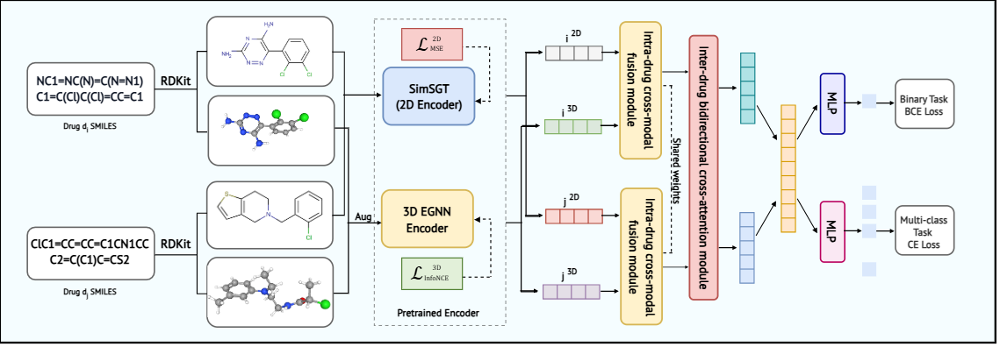

# IAMV-DDI

<p align="center">
  
</p>

<p align="center">
  <em>Overview of IAMV-DDI: 2D molecular topology and 3D molecular geometry are encoded, fused through intra-drug multi-view fusion, and further processed by inter-drug cross-attention for DDI prediction.</em>
</p>

Official implementation of IAMV-DDI, a multi-view drug-drug interaction
prediction pipeline combining:

- a 2D molecular graph encoder based on SimSGT;
- a 3D molecular encoder based on EGNN;
- intra-drug 2D/3D fusion;
- inter-drug cross-attention;
- task-specific heads for binary and multiclass DDI prediction.

The repository provides pipelines for DrugBank, ZhangDDI, multiclass event
prediction, and ablation studies.

> The paper URL, artifact download URL, and final citation will be added after
> publication.

## Repository Structure

```text
.
|-- environment.yml
|-- src/
|   |-- model/
|   |   |-- training_binary.py
|   |   |-- training_multiclass.py
|   |   |-- training_abl.py
|   |   |-- model_ddi.py
|   |   |-- encoder.py
|   |   `-- dataloader*.py
|   |-- pretrained_2D/
|   `-- pretrained_3D/
|-- dataset/                 # local data
|-- checkpoints_ddi/         # generated outputs
`-- training.sh              # example server commands
```

## Environment

The exported environment targets Linux, Python 3.10, PyTorch 2.4.0, and CUDA
12.1.

```bash
conda env create -f environment.yml
conda activate bertddi
```

For an existing environment:

```bash
conda env update -n <env_name> -f environment.yml --prune
conda activate <env_name>
```

Verify the installation:

```bash
python -c "import numpy, pandas, sklearn, rdkit, torch, torch_geometric, torch_scatter; print('Environment OK')"
python -c "import torch; print(torch.__version__, torch.version.cuda, torch.cuda.is_available())"
```

## Data and Artifacts

Datasets, molecular caches, and pretrained checkpoints are excluded from Git
because of their size and licensing conditions. For reproducibility, we provide
the processed data splits, molecular caches, and pretrained checkpoints used in
our experiments through the following Google Drive folder:

[Download processed artifacts](https://drive.google.com/drive/folders/1iOoz_96exm11LN5rMAu-lHGB17C8ZMhL?usp=sharing)

The original benchmark datasets should be cited according to their corresponding
sources. After downloading the artifacts, arrange the files as follows:

```text
dataset/
|-- drugbank/
|   |-- drug2d_cache_DrugBank.pt
|   |-- drug3d_cache_DrugBank.pt
|   |-- model_GAT.pth
|   |-- model_GCN.pth
|   |-- pretrained_2D_DrugBank.pth
|   |-- pretrained_3D_DrugBank.pt
|   |-- id_map.csv
|   |-- ddis.csv  # DDI pair file used for 5-fold
|   `-- fold{1..5}/
|       |-- train.csv
|       |-- valid.csv
|       `-- test.csv
|-- ZhangDDI/
|   |-- drug_list_zhang.csv
|   |-- drug2d_cache_ZhangDDI.pt
|   |-- drug3d_cache_ZhangDDI.pt
|   |-- pretrained_2D_Zhang.pth
|   |-- pretrained_egnn_contrastive_Zhang.pt
|   |-- ZhangDDI_ddi.csv  # DDI pair file used for 5-fold
|   `-- fold{1..5}/
|       |-- train.csv
|       |-- valid.csv
|       `-- test.csv
```

## Pretraining

IAMV-DDI uses separately pretrained 2D and 3D molecular encoders before
downstream DDI prediction. The 2D encoder is pretrained with a masked graph
modeling objective, while the 3D encoder is pretrained with contrastive conformer
learning.

### 2D Molecular Encoder Pretraining

The 2D branch can be pretrained using the script in `src/pretrained_2D/`.
An example command is:

```bash
python3.10 src/pretrained_2D/training.py \
  --batch_size 512 \
  --name "$name" \
  --device "$device" \
  --lr 0.0001 \
  --trans_encoder_layer 4 \
  --trans_decoder_layer 1 \
  --mask_rate 0.35 \
  --custom_trans \
  --transformer_norm_input \
  --drop_mask_tokens \
  --nonpara_tokenizer \
  --gnn_token_layer 1 \
  --loss mse \
  --gnn_type gin \
  --decoder_input_norm \
  --eps 0.5
```

### 3D Molecular Encoder Pretraining

The 3D branch is pretrained using an EGNN encoder with contrastive conformer
augmentation. An example command is:

```bash
python3.10 src/pretrained_3D/training.py
```

The resulting EGNN checkpoint should be passed to the downstream training scripts
through `--ckpt_3d`.

For both 2D and 3D pretraining, the generated checkpoints should be placed under
the corresponding dataset folder, for example:

```text
dataset/
|-- drugbank/
|   |-- pretrained_2D_DrugBank.pth
|   `-- pretrained_3D_DrugBank.pt
|-- ZhangDDI/
|   |-- pretrained_2D_Zhang.pth
|   `-- pretrained_egnn_contrastive_Zhang.pt
```

## Test

Run one binary epoch before starting a full experiment:

```bash
python -u -m src.model.training_binary \
  --dataset drugbank \
  --ckpt_2d dataset/drugbank/pretrained_2D_DrugBank.pth \
  --ckpt_3d dataset/drugbank/pretrained_3D_DrugBank.pt \
  --id_map_path dataset/drugbank/id_map.csv \
  --cache_2d_path dataset/drugbank/drug2d_cache_DrugBank.pt \
  --cache_3d_path dataset/drugbank/drug3d_cache_DrugBank.pt \
  --train_path dataset/drugbank/fold1/train.csv \
  --val_path dataset/drugbank/fold1/valid.csv \
  --test_path dataset/drugbank/fold1/test.csv \
  --epochs 1 \
  --batch_size 128 \
  --num_workers 0 \
  --fold 1 \
  --save_dir checkpoints_smoke \
  --run_name drugbank_binary
```

A successful smoke test loads both encoders, completes forward and backward
passes, writes a best checkpoint, and evaluates it on the test split.

## Binary Prediction

### DrugBank

```bash
python -u -m src.model.training_binary \
  --dataset drugbank \
  --ckpt_2d dataset/drugbank/pretrained_2D_DrugBank.pth \
  --ckpt_3d dataset/drugbank/pretrained_3D_DrugBank.pt \
  --id_map_path dataset/drugbank/id_map.csv \
  --cache_2d_path dataset/drugbank/drug2d_cache_DrugBank.pt \
  --cache_3d_path dataset/drugbank/drug3d_cache_DrugBank.pt \
  --train_path dataset/drugbank/fold1/train.csv \
  --val_path dataset/drugbank/fold1/valid.csv \
  --test_path dataset/drugbank/fold1/test.csv \
  --epochs 200 \
  --batch_size 64 \
  --seed 123 \
  --fold 1 \
  --metric_best acc \
  --save_dir checkpoints_ddi \
  --run_name drugbank_binary_fold1
```

### ZhangDDI

```bash
python -u -m src.model.training_binary \
  --dataset zhang \
  --ckpt_2d dataset/ZhangDDI/pretrained_2D_Zhang.pth \
  --ckpt_3d dataset/ZhangDDI/pretrained_egnn_contrastive_Zhang.pt \
  --id_map_path dataset/ZhangDDI/drug_list_zhang.csv \
  --cache_2d_path dataset/ZhangDDI/drug2d_cache_ZhangDDI.pt \
  --cache_3d_path dataset/ZhangDDI/drug3d_cache_ZhangDDI.pt \
  --train_path dataset/ZhangDDI/fold1/train.csv \
  --val_path dataset/ZhangDDI/fold1/valid.csv \
  --test_path dataset/ZhangDDI/fold1/test.csv \
  --epochs 200 \
  --batch_size 128 \
  --seed 123 \
  --fold 1 \
  --metric_best acc \
  --save_dir checkpoints_ddi \
  --run_name zhang_binary_fold1
```

Available binary selection metrics are `acc`, `f1`, `precision`, `recall`,
`auroc`, and `aupr`.

## Multiclass Prediction

The multiclass pipeline predicts one of 86 DrugBank interaction event types.

```bash
python -u -m src.model.training_multiclass \
  --ckpt_2d dataset/drugbank/pretrained_2D_DrugBank.pth \
  --ckpt_3d dataset/drugbank/pretrained_3D_DrugBank.pt \
  --id_map_path dataset/drugbank/id_map.csv \
  --cache_2d_path dataset/drugbank/drug2d_cache_DrugBank.pt \
  --cache_3d_path dataset/drugbank/drug3d_cache_DrugBank.pt \
  --train_path dataset/drugbank/fold1/train.csv \
  --val_path dataset/drugbank/fold1/valid.csv \
  --test_path dataset/drugbank/fold1/test.csv \
  --num_labels 86 \
  --epochs 200 \
  --batch_size 128 \
  --seed 123 \
  --fold 1 \
  --metric_best acc \
  --save_dir checkpoints_ddi \
  --run_name drugbank_multiclass_fold1
```

Available selection metrics are `acc`, `macro_precision`, `macro_recall`,
`macro_f1`, `macro_auroc`, and `macro_aupr`.

## Ablation Studies

The ablation entry point shares the multiclass training and evaluation
protocol.

```bash
python -u -m src.model.training_abl \
  --ckpt_2d dataset/drugbank/pretrained_2D_DrugBank.pth \
  --ckpt_3d dataset/drugbank/pretrained_3D_DrugBank.pt \
  --id_map_path dataset/drugbank/id_map.csv \
  --cache_2d_path dataset/drugbank/drug2d_cache_DrugBank.pt \
  --cache_3d_path dataset/drugbank/drug3d_cache_DrugBank.pt \
  --train_path dataset/drugbank/fold1/train.csv \
  --val_path dataset/drugbank/fold1/valid.csv \
  --test_path dataset/drugbank/fold1/test.csv \
  --ablation_mode wo_2d \
  --fold 1 \
  --save_dir checkpoints_ddi \
  --run_name ablation_wo_2d_fold1
```

| Mode | Description |
|---|---|
| `full` | Complete 2D/3D model |
| `wo_2d` | Remove the 2D molecular branch |
| `wo_3d` | Remove the 3D molecular branch |
| `wo_intra_fusion` | Disable intra-drug cross-modal fusion |
| `wo_inter_fusion` | Disable inter-drug cross-attention |

Use the same folds, seeds, optimizer settings, and selection metric for all
ablation variants.

### Additional Ablation Settings

| Ablation Type | Variant | How to Run |
|---|---|---|
| Encoder backbone | GCN | Replace the pretrained 2D encoder checkpoint and loader with the GCN-based version |
| Encoder backbone | GAT | Replace the pretrained 2D encoder checkpoint and loader with the GAT-based version |
| Encoder backbone | GIN | Default encoder backbone used in IAMV-DDI |
| Fusion strategy | Sum | Set the fusion mode in `src/model_ddi.py` to use summation-based fusion |
| Fusion strategy | Concat | Set the fusion mode in `src/model_ddi.py` to use concatenation-based fusion |
| Fusion strategy | Gated | Default adaptive fusion strategy used in IAMV-DDI |

All variants use the same data folds, random seeds, optimizer settings, early stopping criterion, and evaluation metrics as the full model.


## Outputs

```text
checkpoints_ddi/
|-- <run_name>_best.pt
`-- predictions/
    `-- <run_name>/
        |-- foldN_best_val_preds.npz
        `-- foldN_final_test_preds.npz
```

Binary prediction files contain labels, probabilities, logits, scalar
metrics, and pair embeddings. Multiclass evaluation additionally writes
per-class metrics for downstream figures.

## Reproducibility Checklist

Record the following for every reported result:

- Git commit hash;
- dataset and fold;
- random seed;
- pretrained 2D and 3D checkpoint names;
- model and optimizer arguments;
- GPU model and CUDA version;
- best validation epoch and selection metric;
- final test metrics from the selected checkpoint.

## License

A project license has not yet been added. Add a `LICENSE` file before public
release and verify the redistribution terms of DrugBank and all pretrained
components.
